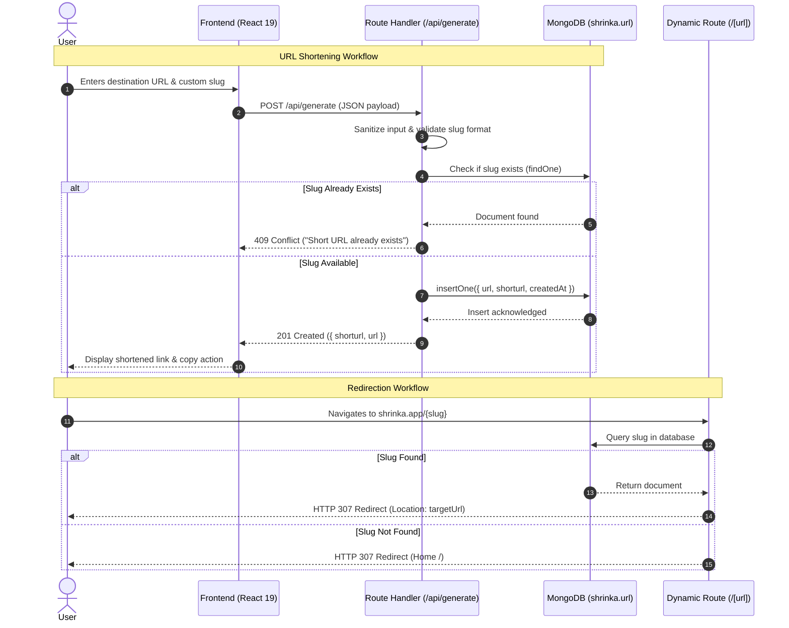

# 🔗 Shrinka — Modern Full-Stack URL Shortener

<div align="center">


<p align="center">
  <strong>A high-performance, responsive, and intuitive full-stack URL shortening service engineered with Next.js App Router, React 19, and MongoDB.</strong>
</p>

[Explore Features](#-key-features) • [System Architecture](#-system-architecture) • [Getting Started](#-getting-started) • [API Reference](#-api-endpoints) • [Engineering Highlights](#-engineering-highlights)

</div>

---

## 📌 Executive Summary

**Shrinka** is a full-stack web application that transforms long, cumbersome URLs into clean, memorable, and shareable short links. Designed with modern web standards and architectural best practices, Shrinka features sub-millisecond dynamic routing redirects, robust input sanitization, collision-proof database queries, and an aesthetic glassmorphism UI.

---

## ✨ Key Features

- **⚡ Lightning-Fast Redirections**: Dynamic routing powered by Next.js Server Components and MongoDB indexing for instant HTTP 307 redirects.
- **🏷️ Custom Alias Generation**: Allows users to specify personalized, memorable slugs for their shortened URLs.
- **🛡️ Protocol & URL Normalization**: Automatically validates destination URLs and enforces secure protocol prefixes (`https://` / `http://`).
- **🔒 Collision & Reserved Word Safeguards**: Built-in duplicate detection and strict reservation of system routes (`shorten`, `about`, `contact`, `api`).
- **📋 One-Click Clipboard Copying**: Instant link copying with dynamic visual confirmation and direct navigation options.
- **📱 Fully Responsive & Accessible**: Mobile-first design with interactive drawer navigation, clean typography, and WCAG-compliant contrasts.
- **🎨 Glassmorphic Modern UI**: Crafted with Tailwind CSS v4, featuring ambient gradients, micro-animations, and custom brand SVG icons.

---

## 🛠️ Tech Stack & Architecture

| Layer | Technology | Description |
| :--- | :--- | :--- |
| **Framework** | Next.js 16 (App Router + Turbopack) | Server Components, dynamic route handlers, and SSR |
| **Frontend** | React 19 | Client state management, hooks, and responsive UX |
| **Styling** | Tailwind CSS v4 | Utility-first CSS, modern gradients, and responsive layouts |
| **Database** | MongoDB & Native MongoDB Driver | High-throughput document store for URL mappings |
| **Deployment / Runtime** | Node.js (v18+) | Server-side execution and API routing |

---

## 🏛️ System Architecture & Workflow



---

## 🚀 Getting Started

### Prerequisites

Ensure you have the following installed on your machine:
- [Node.js](https://nodejs.org/) (version 18.17.0 or higher)
- [MongoDB](https://www.mongodb.com/) (local instance running on port 27017 or MongoDB Atlas URI)
- [Git](https://git-scm.com/)

### 1. Clone the Repository

```bash
git clone https://github.com/your-username/shrinka_url.git
cd shrinka_url
```

### 2. Install Dependencies

```bash
npm install
```

### 3. Configure Environment Variables

Create a `.env.local` file in the root directory:

```env
# MongoDB Connection String
MONGODB_URI=mongodb://localhost:27017

# Application Host URL (used for generating links)
NEXT_PUBLIC_HOST=http://localhost:3000
```

### 4. Run Development Server

```bash
npm run dev
```

Open [http://localhost:3000](http://localhost:3000) in your browser to view the application.

---

## 📡 API Endpoints

### 1. Generate Short URL

- **Endpoint**: `/api/generate`
- **Method**: `POST`
- **Content-Type**: `application/json`

#### Request Payload:
```json
{
  "url": "https://google.com",
  "shorturl": "google"
}
```

#### Success Response (`201 Created`):
```json
{
  "success": true,
  "error": false,
  "message": "URL generated successfully!",
  "shorturl": "google",
  "url": "https://google.com"
}
```

#### Error Responses:
- `400 Bad Request`: Missing fields, invalid URL structure, or reserved slug attempt.
- `409 Conflict`: Short URL alias already in use.
- `500 Internal Server Error`: Database connectivity or unhandled server exceptions.

---

## 📂 Project Structure

```text
Shrinka_url/
├── app/
│   ├── [url]/
│   │   └── page.js           # Dynamic catch-all route for link redirection
│   ├── about/
│   │   └── page.jsx          # About page presenting platform philosophy
│   ├── api/
│   │   └── generate/
│   │       └── route.js      # REST API handler for URL generation & validation
│   ├── contact/
│   │   └── page.jsx          # Contact and FAQ interface
│   ├── shorten/
│   │   └── page.js           # Interactive URL shortening dashboard
│   ├── globals.css           # Global Tailwind CSS configurations
│   ├── icon.svg              # Next.js App Router dynamic vector favicon
│   ├── layout.js             # Root layout with shared navigation, footer & SEO tags
│   └── page.js               # Landing page with hero section & CTA
├── components/
│   ├── Navbar.js             # Sticky navigation bar with mobile drawer
│   └── Footer.js             # Application footer with navigational links
├── lib/
│   └── mongodb.js            # Cached global MongoDB client singleton
├── public/                   # Static assets, brand SVGs, and illustrations
├── .env.local                # Local environment variables configuration
├── package.json              # Project dependencies and npm scripts
└── README.md                 # Project documentation
```

---

## 💡 Engineering Highlights & Best Practices

- **Global Client Caching**: Uses a singleton connection pattern (`global._mongoClientPromise`) in development to prevent connection exhaustion during Next.js Fast Refresh cycles.
- **Strict Protocol Sanitization**: Guarantees that short links without explicit schemes are normalized to `https://` before redirecting, eliminating relative route redirection loops.
- **Graceful Error Handling**: Complete input validation on both client and server boundaries to ensure reliable user feedback without application crashes.
- **SEO & Social Sharing Ready**: Includes complete OpenGraph-compatible metadata and modular layout structure.

---

## 📄 License

This project is licensed under the **MIT License**. Feel free to use, modify, and distribute as desired.

---

<div align="center">
  <sub>Developed with ❤️ using Next.js, React, and MongoDB.</sub>
</div>
